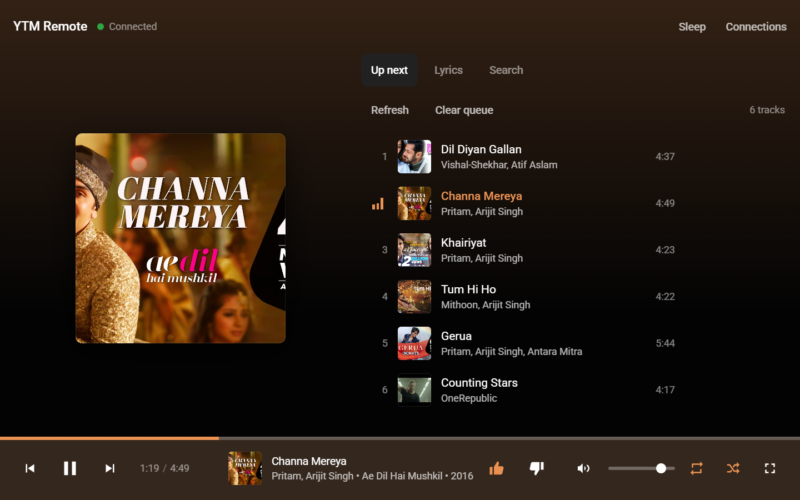
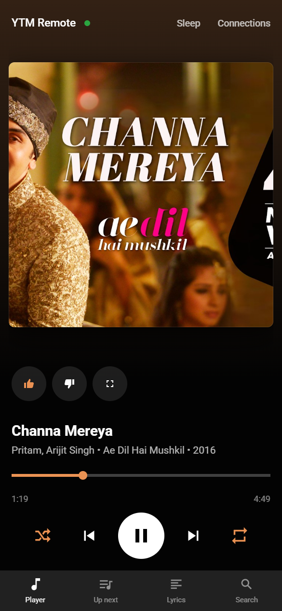
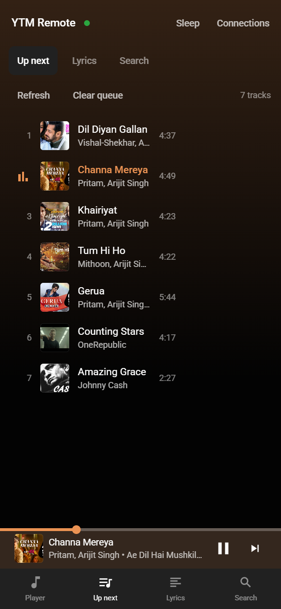
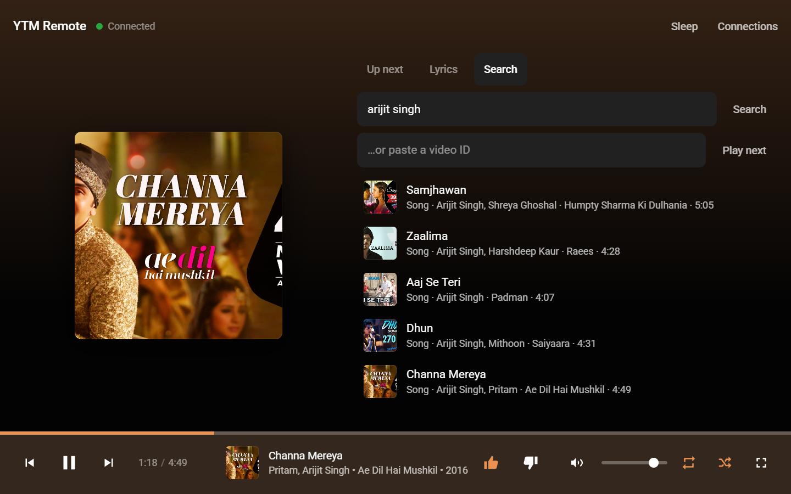
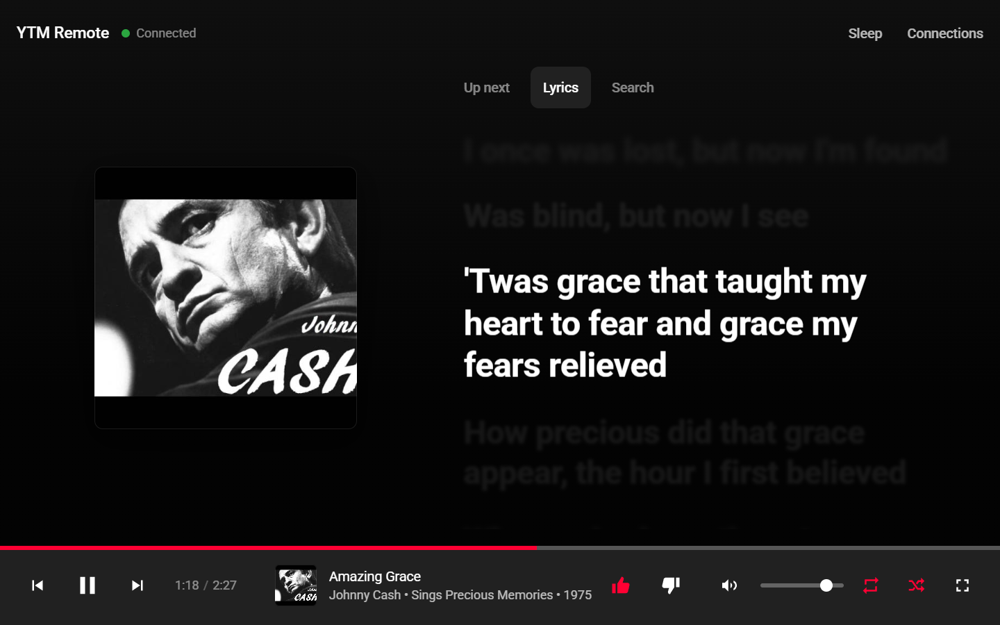

# YTM Remote

A browser remote control for the [YouTube Music desktop app](https://github.com/th-ch/youtube-music). One HTML file, no build step, no backend — it talks straight to the app's **API Server** plugin running on your own machine.

**→ [Open the remote](https://surajbhari.com/ytm-remote/)**

Your connection details stay in `localStorage` in your browser. Nothing is sent anywhere except to the player address you enter.

## Setup

1. In the YouTube Music desktop app, open **Plugins → API Server** and enable it. Note the port it reports (mine is `26538`).
2. Open the remote and click **Connections**.
3. Enter the address (`http://localhost:26538`), give it a name, and click **Add and connect**.
4. If the plugin is set to ask before granting access, an approval prompt appears in the desktop app — accept it. The request blocks until you do.

The token you get back is saved locally, so you only do this once per device. You can save several players and switch between them.

The interface follows YouTube Music's own layout — a persistent player bar, a queue pane,
and a page that takes its colour from the current album art. On a phone it collapses to a
full-screen player with a mini bar and bottom tabs; on a tablet or desktop the queue sits
beside the artwork.

## What it does

**Playback** — play/pause, previous, next, seek by dragging the counter bar, jump back and forward 10 seconds.

**Track** — title, artist, album, artwork, play count, release year, duration, media type, and a link to the track on YouTube.

**Rating** — like and dislike, showing the current state.

**Modes** — shuffle, repeat (off / all / one), volume, and mute.

**Fullscreen** — the button puts *this page* into fullscreen, which is what you want on a
phone or a spare monitor. It follows Esc and F11 too, and hides itself on browsers with no
Fullscreen API (iOS Safari).

**System media controls** — the current track appears in your phone's notification shade and
on the lock screen, so you can skip and pause without opening the page. An OS only offers
that to a page playing audio, so a silent loop holds the audio focus; browsers require a
gesture to start audio, so it arms on your first tap. Android Chrome is the reliable case,
iOS Safari is stricter.

Scrolling over the volume control nudges it.

**Queue** — the full queue with the current track highlighted; click to jump to a track, reorder it, remove it, or clear the queue. A separate tab shows what's coming up next.

**Search** — search the YouTube Music catalogue and drop any result into the queue. You can also paste a raw video ID.

**Lyrics** — time-synced where they exist, scrolling themselves and dimming what has passed.
Tap any line to jump to that moment. Sources are tried in order and synced always wins over
plain: [LRCLIB](https://lrclib.net) (timed LRC), then [lyrics.ovh](https://lyrics.ovh) as a
plain-text backstop. Candidates are ranked by track length, because the same title is often
uploaded at several different durations and the wrong one drifts audibly.

### Keyboard

| Key | Action | Key | Action |
|---|---|---|---|
| `Space` | Play / pause | `M` | Mute |
| `←` `→` | Seek ∓10s | `S` | Shuffle |
| `N` / `P` | Next / previous | `R` | Repeat |
| `L` | Like | `F` | Fullscreen (this page) |

## Browser support

The page is served over HTTPS from GitHub Pages but calls `http://localhost`. Browsers treat `localhost` as a trusted origin, so this is allowed in **Chrome and Edge** (the plugin also sends `Access-Control-Allow-Private-Network`, which Chrome requires).

**Safari blocks it.** If you use Safari, download `index.html` and open it locally, or serve it over plain `http://`.

## Notes on the API

Things worth knowing if you build against the same API:

- **`GET` and `POST /api/v1/volume` use different scales.** The player reports a perceptual
  value but accepts a raw one, so sending a reading straight back collapses the level —
  measured 60 → 29 → 8 → 1 on repeat. Treat the slider as a command value you own rather
  than a readback. This page seeds it once from the player through the inverse of the curve
  (roughly `raw = 100 · (reported/100)^0.4`) and never overwrites it afterwards.
- Nothing applies while the player is idle. `volume`, `toggle-mute`, `switch-repeat` and
  `shuffle` all return `204` and change nothing until a track is actually playing, and
  `GET /volume` and `GET /repeat-mode` report `0` and `null` until then too. If those
  controls look dead, start a track first.
- The socket only pushes on track and playback changes, not on volume, mute, repeat or
  shuffle. To read true state after one of those, open a fresh socket: every connection
  starts with a current `PLAYER_INFO`.
- `POST /api/v1/queue` with `insertPosition: INSERT_AT_END` returns `204` but does not change an autoplay/radio queue. `INSERT_AFTER_CURRENT_VIDEO` works, so every add here uses it.
- `GET /api/v1/song` sometimes omits `imageSrc`, while the WebSocket's `PLAYER_INFO.song`
  includes it. The artwork drives the page colour here, so the socket payload fills the gap.
- `GET /api/v1/queue` returns a large payload (~900 KB for 50 tracks), so the queue is fetched on demand rather than on the polling loop.

State comes from polling `/api/v1/song` once a second, with the plugin's WebSocket layered on top for instant response to play/pause, volume, shuffle and repeat changes.

The page colour is sampled from the artwork on a canvas. That needs a CORS-clean image, so
the sampler requests the cover under its own cache key — the visible `` is loaded
normally and never depends on CORS, so artwork still shows even if sampling fails.

## Licence

MIT
